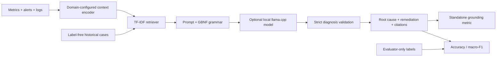

# GroundedX

GroundedX is a small, retrieval-grounded diagnosis pipeline for multivariate
metrics, alerts, and log lines. It builds a label-free knowledge base, retrieves
auditable evidence, and validates diagnosis outputs against a closed taxonomy
and retrieved citation IDs. The core is domain-configured so the same pipeline
can support AIOps/SRE, industrial telemetry, security alerts, and the included
O-RAN reference benchmark.

O-RAN is the flagship reference domain; `domains/sre-k8s/` is a smaller worked
example showing that the core does not import or assume O-RAN data.

## Paper-reported reference result

The following are the paper-reported values from the supplied manuscript, not
an independent claim that the current legacy scripts reproduce them exactly.
Reproduction details and known limitations are in
[`docs/reproducing_paper_results.md`](docs/reproducing_paper_results.md).

| Method | Top-1 accuracy | Macro-F1 |
| --- | ---: | ---: |
| Rule-based expert system | 0.332 +/- 0.004 | 0.356 +/- 0.003 |
| RandomForest structured features | 0.571 +/- 0.003 | 0.599 +/- 0.004 |
| Zero-shot SLM, 3B Q4 | 0.520 +/- 0.003 | 0.480 +/- 0.004 |
| RAG SLM, 3B Q4 | 0.700 +/- 0.003 | 0.670 +/- 0.004 |

## Architecture



## Install and quickstart

```powershell
py -3.11 -m venv .venv
.\.venv\Scripts\Activate.ps1
python -m pip install -e ".[dev]"
python -m groundedx.pipeline --domain domains/oran --n 32 --seed 7
python -m groundedx.pipeline --domain domains/sre-k8s --n 32 --seed 7
pytest
```

Local GGUF generation is optional:

```powershell
pip install -e ".[llama]"
```

Download model weights separately and follow the [Qwen Research License](https://huggingface.co/Qwen/Qwen2.5-3B-Instruct/blob/main/LICENSE).
This repository does not redistribute LLM weights. GPU profiling additionally requires
`pip install -e ".[profiling]"` and an NVIDIA GPU with NVML.

## Bring your own telemetry

Create a `domains/<name>/` directory with a closed taxonomy, metric schema,
and Jinja prompt template. The step-by-step guide is in
[`docs/adding_a_new_domain.md`](docs/adding_a_new_domain.md).

## Data and limitations

The benchmark is synthetic and the KB is researcher-authored. The checked-in
prototype artifacts are useful for inspection, but the generated 4,000-window
dataset should remain a release asset rather than source control content. The
current implementation uses TF-IDF retrieval; embedding retrieval, real-world
testbed validation, multi-seed profiling, and additional domains remain future
work. See [`data/README.md`](data/README.md).

## Citation

The manuscript is currently in review; no venue DOI or page numbers are claimed.
The author list below matches the supplied manuscript.

```bibtex
@unpublished{ran_doc_2026,
  author = {Tanishq Singh Sisodiya and Samarth Agrawal and Mallellu Sai Prashanth and Rajanikanth Aluvalu},
  title  = {RAN-Doc: Retrieval-Augmented Small Language Models for Edge-Deployable Fault Diagnosis in AI-Native O-RAN},
  note   = {Manuscript under review at IEEE GLOBECOM 2026},
  year   = {2026}
}
```

## License

Code is released under the MIT License. Any model weights, runtime binaries,
or third-party datasets remain under their own licenses.
