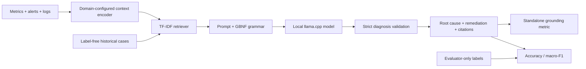

# GroundedX

GroundedX is a small, retrieval-grounded diagnosis pipeline for multivariate
metrics, alerts, and log lines. It builds a label-free knowledge base, retrieves
auditable evidence, and validates diagnosis outputs against a closed taxonomy
and retrieved citation IDs. The core is domain-configured so the same pipeline
can support AIOps/SRE, industrial telemetry, security alerts, and the included
O-RAN reference benchmark.

O-RAN is the flagship reference domain; `domains/sre-k8s/` is a smaller worked
example showing that the core does not import or assume O-RAN data.

## Results

All results are regenerated from raw per-window outputs under `results/v2/`.
The single source of truth is [`results/v2/RESULTS.md`](results/v2/RESULTS.md)
(human-readable) and `results/v2/numbers.json` (every number, machine-readable),
both written by `scripts/make_results.py`. No numbers are maintained by hand.

## Reproducing the experiments

```bash
pip install -e ".[dev,profiling]"
pytest                                   # claims checks: docs/CLAIMS_CHECK.md
python scripts/run_baselines.py          # rule, RandomForest, GBDT, kNN-vote, retrieval (CPU)
# SLM runs need llama.cpp's llama-server (build b11398) and the GGUFs in configs/experiment.yaml
LLAMA_SERVER_BIN=/path/to/llama-server python scripts/run_queue.py --phase accuracy --gpus 0 --models-dir models
LLAMA_SERVER_BIN=/path/to/llama-server python scripts/run_queue.py --phase profile --gpus 0 --models-dir models --tag rtx3050
python scripts/make_results.py
```

`notebooks/kaggle_revision_runs.ipynb` runs the GPU jobs on Kaggle (2x T4).
A seed controls dataset generation, the 70/15/15 split, KB case sampling, and
the tree baselines' `random_state`; decoding is greedy (temperature 0).

## Architecture



## Install and quickstart

```powershell
py -3.11 -m venv .venv
.\.venv\Scripts\Activate.ps1
python -m pip install -e ".[dev]"
python -m groundedx.pipeline --domain domains/oran --n 32 --seed 7
python -m groundedx.pipeline --domain domains/sre-k8s --n 32 --seed 7
pytest
```

Local GGUF generation is optional:

```powershell
pip install -e ".[llama]"
```

Download model weights separately and follow the [Qwen Research License](https://huggingface.co/Qwen/Qwen2.5-3B-Instruct/blob/main/LICENSE).
This repository does not redistribute LLM weights. GPU profiling additionally requires
`pip install -e ".[profiling]"` and an NVIDIA GPU with NVML.

## Bring your own telemetry

Create a `domains/<name>/` directory with a closed taxonomy, metric schema,
and Jinja prompt template. The step-by-step guide is in
[`docs/adding_a_new_domain.md`](docs/adding_a_new_domain.md).

## Data and limitations

The benchmark is synthetic and the KB is built from the simulator's own training
windows. Results do not transfer to live networks without validation on real
incidents. See [`data/README.md`](data/README.md).

## License

Code is released under the MIT License. Any model weights, runtime binaries,
or third-party datasets remain under their own licenses.
